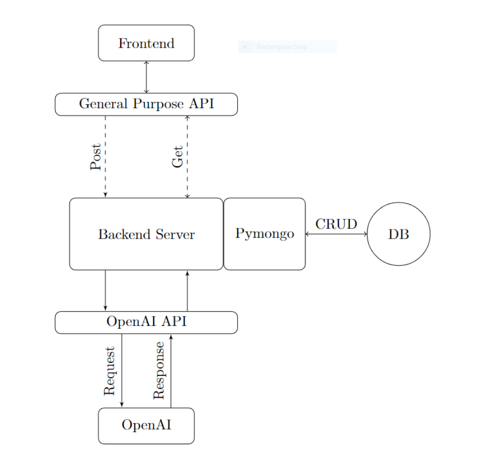

# Let them cook now! 

## What is the our app? 

This app is a tool for users to automatically generate recipes based on the ingredients they have at home. The application performs the following tasks:

Checks for New Ingredients: Users can input or update their current stock of ingredients via the application interface.
Generates Recipes: Every time new ingredients are added, the app automatically suggests new recipes that utilize these ingredients.
Outputs to User’s Desired Format: The recipes can be viewed directly on the app, or sent to the user’s preferred app such as Evernote or Google Keep for grocery planning or meal scheduling.

For more details, view the full project proposal [here](https://docs.google.com/document/d/1pUqwvo_EB_mWArFaJ1a83Q5kxE086z-QvFdbJX_tKhI/edit?usp=sharing).

## Introduction
This application enables users to generate recipes based on specified ingredients. The frontend is developed with React.js, Tailwind CSS, and Material UI, ensuring a seamless and responsive user experience. The backend uses Flask and the OpenAI API for dynamic recipe generation.

## Technical Architecture

## Getting Started

### Prerequisites
- Node.js and npm (https://nodejs.org/)
- Python 3.x (https://www.python.org/downloads/)

### Environment Setup

#### Frontend
1. Navigate to the frontend directory:
cd cooking-app-frontend

2. Install dependencies:
npm install

3. Start the development server:
npm start

#### Backend
1. Navigate to the backend directory:
cd CS222

2. Install Python dependencies:
pip install -r requirements.txt

3. Set up OpenAI API key:
- Generate an API key at https://beta.openai.com/signup/
- Save the key in `.env` as `OPENAI_API_KEY=<Your_API_Key_Here>`

4. Run the Flask application:
python3 main.py

## Usage
Open your web browser and navigate to `http://localhost:3000` to use the application. The application consists of several routes:
- `/`: The main dashboard where you can interact with the application and submit ingredients.
- `/login`: The login page for existing users to access their accounts.
- `/signup`: The sign-up page for new users to create an account.

## Developers
- **Anindya Sharma** (anindya4): Frontend Development 
- **Shreni Jain** (sjain215): Frontend Development
- **Keene Huynh** (keeneh2): Backend Development 
- **Sky Liu** (liu327): Backend Development

## Contributing
Contributions are welcome! Please open an issue first to discuss what you would like to change.

## License
[MIT](https://choosealicense.com/licenses/mit/)
